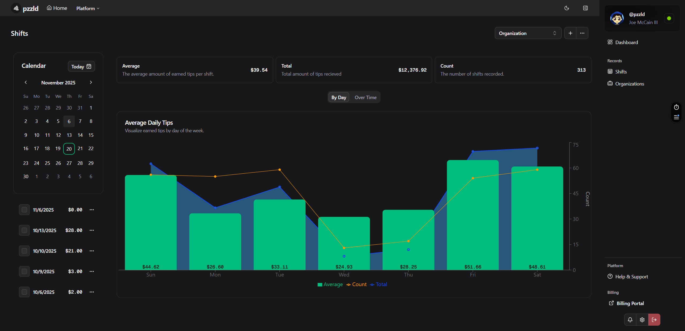

# pzzld-org-tips

***

An application for tracking and managing your tips.

## Features

* Maintain your own tip ledger, including tip amounts, dates, and sources.
* Use the dashboard to quickly view your total tips, average tip amounts, and tip history.
* Export your tip data to CSV or JSON for further analysis or record-keeping.

## Screenshots

